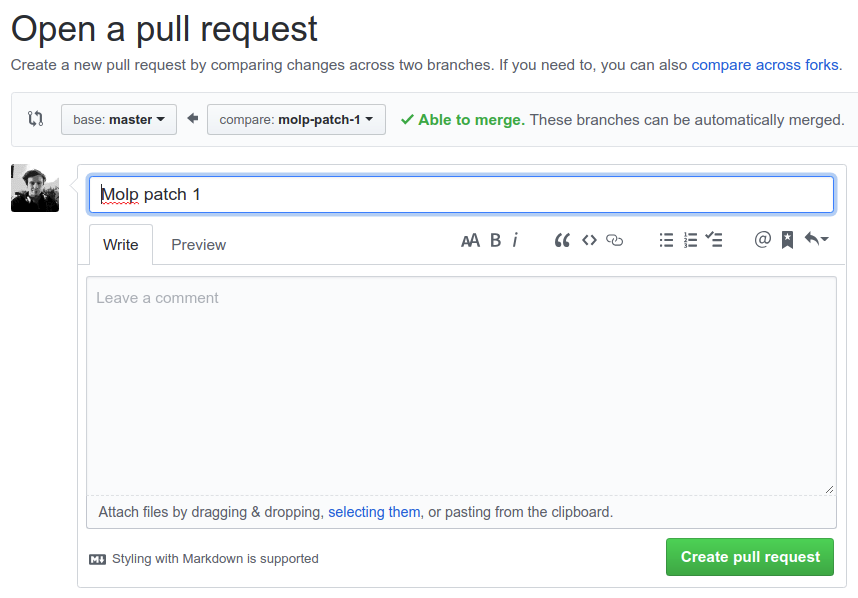

# AirlineSim Documentation

This is the official AirlineSim documentation.  

While the initial content is created by the team, we highly encourage you to contribute articles and corrections via GitHub Pull Requests. See below for details.

## How to contribute to the documentation

The AirlineSim documentation website consists of static websites that are being generated with [Hugo](https://gohugo.io) using the data in this repository.

All contributions are being reviewed by a AirlineSim team member and then added to this repository.

There are two ways to contribute content: Using the GitHub website or Editing the wiki on your own machine.

## Contribute by using the GitHub website

Github allows to view and edit the documentation files directly on its web site. No need to download or install anything!

On the top right corner of each article in the documentation you will find a "Edit this page" button:


Clicking on it will open the corresponding source file in GitHub. You can now edit and preview the file to your liking. When you're done scroll down and enter a summary and a short description about your change. The summary will become the commit message and is usually in present tense ("Fix typo", "Add more details", etc.).

As shown below select the second option to create a new branch and start a pull request:


This will save your changes to your own branch and immediately open the window for a new Pull Request. If you plan to do multiple changes at once you can now edit other files and come back to this later. If you want to submit the changes now, fill out the details and hit "create pull request" 



A member of the team will then review your changes and either accept them or get back to you if he/she has questions. In both cases you will get a notification.


## Contribute by editing the wiki on your own machine

Using GitHub to edit the documentation is convenient but also limited. For larger changes it's better to checkout the documentation and edit it on your local machine. That way you also can preview the whole documentation in your browser.

### Install Hugo

Hugo is a static site generator that runs on most operating systems. Please visit [the official website](https://gohugo.io/getting-started/installing/) and follow the installation instructions.

### Install git

The second tool we need is git. There are several git clients available for all operating systems. Check out the installation guide [here](https://git-scm.com/book/en/v2/Getting-Started-Installing-Git) for command line versions or if you prefer a visual client have look at [Sourcetree](https://www.sourcetreeapp.com/).  

### Fork and clone the repository

If you don't have an [GitHub](https://github.com/) account please create one to proceed.

Since only a few team members have write access to the repository you will have to work on your own copy and submit changes via Pull Requests.

Use the fork button to create your own fork of the documentation:


Now you can checkout your copy using the URL provided by GitHub:


### Build and run the documentation

To build and run the documentation a single Hugo command is enough:

```bash
hugo -D serve
```

This will create all the articles from the sources and start a local webserver serving the documentation. Navigate to the given URL (most likely ```http://localhost:1313/wiki/```) in your browser to see it. 

You can now start to modify and add to the documentation. The website will reflect changes automatically and instantly as long as you keep the hugo command running.

### Submit changes as Pull Requests

If you finished editing your local copy of the documentation and want the changes to be added the official documentation you need to commit and push first.

After the push go to the GitHub site of the official documentation and create a new Pull Request. As a source of changes you can now select your own fork of the repository.